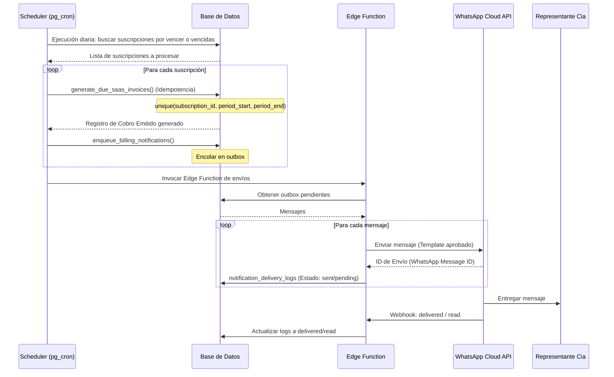

# Plan de Automatización de Cobros SaaS y Mensajería WhatsApp

Este documento detalla el análisis y diseño conceptual para la futura automatización del flujo de facturación y notificaciones vía WhatsApp en el panel Super Admin de MotoGremio. No corresponde a código de producción ni componentes del MVP.

---

## 1. Reglas Conceptuales Obligatorias
1. **Cobro Emitido:** Es una obligación de pago o cuenta por cobrar. Se puede generar automáticamente en el futuro de manera segura mediante un scheduler o tarea programada diaria, siempre que exista una suscripción activa, un período válido y no exista un cobro duplicado activo para dicho período (idempotencia).
2. **Pago Registrado:** Representa el dinero real ingresado a caja. **Bajo ninguna circunstancia se debe generar o marcar automáticamente** basándose únicamente en la existencia del Cobro Emitido. Requiere una confirmación real:
   - Registro o validación manual por parte del Super Admin.
   - Envío de un comprobante de transferencia/depósito validado manualmente.
   - Integración futura con pasarela de pagos (ej: Stripe, Kushki, Payphone) o APIs bancarias con conciliación confirmada.
3. **Mensajería WhatsApp:** Se utiliza única y exclusivamente como canal de notificación, alerta e información de estados. Un mensaje enviado no certifica ni equivale a la recepción de un pago.
4. **Despliegue Seguro:** La automatización operará en dos etapas: primero mediante un modo semiautomático (revisión y aprobación manual de cobros y mensajes encolados) y posteriormente en modo automático controlado.

---

## 2. Flujo del Proceso Futuro Recomendado

### Detalle del Flujo:
1. **Detección:** Un scheduler diario (ej. pg_cron en Supabase) revisa las suscripciones activas (`company_subscriptions`).
2. **Generación:** Si detecta una renovación próxima o vencimiento, invoca una RPC idempotente para crear el **Cobro Emitido**.
3. **Encolado:** La base de datos crea una entrada en la cola de salida (`notification_outbox`).
4. **Envío:** Una Edge Function de Supabase toma los pendientes, interactúa de forma segura con la **API de WhatsApp Business (Cloud API)** y actualiza el estado de entrega.
5. **Conciliación:** Una vez que el cliente realiza la transferencia y se valida el dinero en caja, el Super Admin registra manualmente el **Pago** (o se liquida vía pasarela), disparando un WhatsApp de agradecimiento y confirmación.

---

## 3. Casos de Mensajería WhatsApp y Variables
Todos los envíos utilizarán plantillas autorizadas previamente en Meta.

### Casos de Envío:
1. **Próximo Vencimiento:** Se dispara 7 días antes de la fecha límite (configurable).
2. **Cobro Emitido:** Se dispara al crearse automáticamente la cuenta por cobrar.
3. **Pago Vencido (Mora):** Se dispara un día después del vencimiento si el cobro sigue pendiente o parcial.
4. **Pago Parcial:** Confirmación de abono parcial y aviso de saldo pendiente restante.
5. **Pago Recibido:** Confirmación definitiva de saldo cancelado y liquidación de obligación.
6. **Suspensión de Servicio:** Advertencia o confirmación de bloqueo de acceso de la cooperativa.
7. **Reactivación:** Confirmación de reactivación tras saldar la deuda.

### Variables Disponibles para Plantillas:
* `company_name`: Nombre legal o comercial de la cooperativa.
* `representative_name`: Nombre del representante.
* `representative_phone`: Teléfono de WhatsApp destino.
* `invoice_number`: Número interno del cobro (ej. SaaS-2026-000001).
* `period_start` y `period_end`: Fechas del ciclo de servicio.
* `due_date`: Fecha máxima de vencimiento.
* `amount`: Valor total a cancelar.
* `balance`: Saldo pendiente actual.
* `payment_amount`: Monto abonado en la transacción.
* `payment_method`: Método utilizado (Transferencia, Efectivo, etc.).
* `payment_reference`: Código o número de comprobante.
* `support_contact`: Datos de soporte de MotoGremio.
* `payment_link_future`: Enlace para pagar online de forma directa (etapa futura).

---

## 4. Arquitectura Tecnológica Sugerida
* **Frontend (Super Admin Panel):**
  * Pantalla para configurar parámetros globales de la automatización (activar/desactivar, horas de corrida).
  * Monitoreo de la cola de envíos y bitácora de ejecuciones de scheduler.
  * **Restricción:** El frontend nunca maneja credenciales de la API de WhatsApp, tokens de Meta o llaves de `service_role`.
* **Base de Datos (Supabase PostgreSQL):**
  * Tablas específicas con políticas de Row Level Security (RLS) restrictivas.
  * Triggers de validación de unicidad e idempotencia para bloquear cobros duplicados.
* **Backend y Middleware (Supabase):**
  * `pg_cron` o scheduler oficial de Supabase para iniciar la revisión de obligaciones a horas específicas de la noche.
  * **Edge Functions (Deno):** Manejan la lógica de construcción de payloads de Meta Business Suite y ejecutan el request HTTP con autorización de forma aislada.
  * **Supabase Vault / Secrets:** Para almacenar los tokens de WhatsApp seguros e invisibles al frontend.
  * **Webhook:** Endpoint en Edge Function para recibir la respuesta de Meta con el estado del mensaje (`sent`, `delivered`, `read`, `failed`).

---

## 5. Esquema de Tablas Futuras
* `automation_settings`: Reglas generales de automatización (ej. `auto_generate_invoices`, `auto_send_reminders`, `execution_hour`).
* `notification_templates`: Registro de plantillas de WhatsApp aprobadas por Meta y su mapeo a eventos del sistema.
* `notification_outbox`: Mensajes encolados con estado `pending` para envío secuencial o batch.
* `notification_delivery_logs`: Logs de entrega del proveedor (`message_id`, `status` [sent, delivered, read, failed], `error_message`, `retries_count`).
* `automation_runs`: Historial de ejecuciones diarias del programador para control interno de MotoGremio.
* `company_contact_preferences`: Registro de consentimiento (opt-in) de cada cooperativa, números de teléfono alternos y opción de exclusión manual (opt-out).

---

## 6. RPCs e Idempotencia del Sistema
* `preview_due_saas_invoices()`: Permite al Super Admin visualizar de forma segura qué deudas se generarán antes de dar la orden física de ejecución en modo semiautomático.
* `generate_due_saas_invoices()`: Procesa la creación de las facturas en la base de datos de manera atómica con validación estricta de unicidad temporal por período.
* `enqueue_billing_notifications()`: Revisa los cobros generados y encola los mensajes correspondientes en `notification_outbox`.
* `send_pending_whatsapp_notifications()`: Llamada por la Edge Function para extraer la cola pendiente a procesar.
* `process_whatsapp_webhook()`: Procesa la confirmación asíncrona de lectura o entrega de los mensajes.

---

## 7. Control de Duplicaciones y Seguridad
* **Protección Anti-Duplicados en Facturas:** Restricción de base de datos única compuesta `UNIQUE(subscription_id, period_start, period_end)` en la tabla `saas_invoices`. Los cobros anulados (`void`) no bloquearán nuevas emisiones.
* **Idempotency Key en Envíos:** Cada notificación tendrá una llave de idempotencia autogenerada basada en `invoice_id + event_type` para garantizar que un problema de reintento de conexión no envíe el mismo mensaje dos veces al mismo representante.
* **Seguridad Operativa:** Todo envío queda auditado. El representante puede pausar o desactivar el envío de alertas desde su cooperativa (opt-out) para evitar spam, priorizando el soporte por canales directos.
